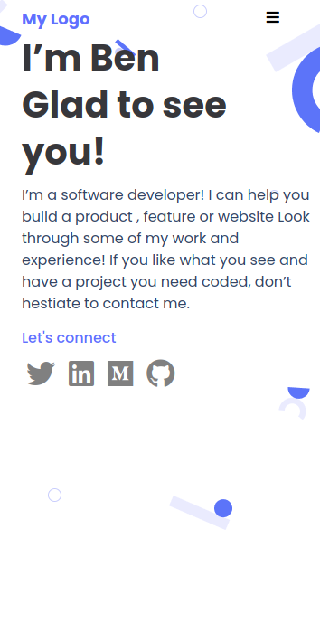

# Project Name

> Portfolio Website Mobile version

## Built With

- HTML5 / CSS3

## Live Demo

[Live Demo Link](https://goldinium.github.io/portfolio_website/)

## Getting Started

To get a local copy up and running follow these simple example steps.

Clone using HTTPS
https://github.com/Goldinium/portfolio_website.git

OR

Clone using SSH 
git@github.com:Goldinium/portfolio_website.git

## Authors

👤 **Author1**

- GitHub: [@goldinium](https://github.com/goldinium)

## 🤝 Contributing

Contributions, issues, and feature requests are welcome!

Feel free to check the [issues page](../../issues/).

## Show your support

Give a ⭐️ if you like this project!

## Acknowledgments

- Hat tip to anyone whose code was used
- Inspiration
- etc

## 📝 License

This project is [MIT](./MIT.md) licensed.
